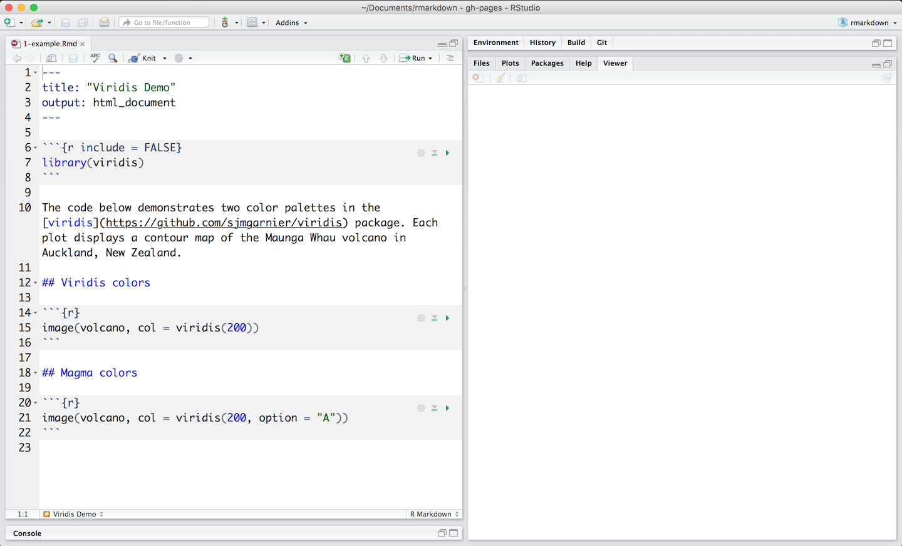
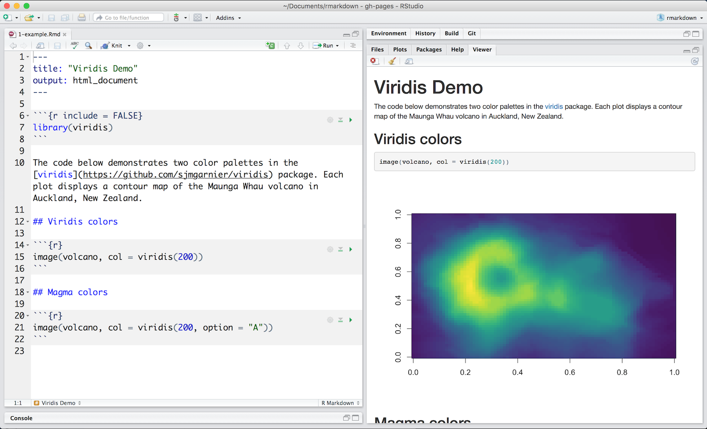

```{r setup, include=FALSE}
knitr::opts_chunk$set(echo = TRUE)
```

***

# Introduction
## Overview
R Markdown provides an authoring framework for data science. You can use a single R Markdown file to both

* save and execute code
* generate high quality reports that can be shared with an audience


R Markdown documents are fully reproducible and support dozens of static and dynamic output formats.

## Installation
Like the rest of R, R Markdown is free and open source. You can install the R Markdown package from CRAN with:


```
install.packages("rmarkdown")
```

## Get Started
The links to the left provide a quick tour of R Markdown. The links at the top provide examples of R Markdown documents, as well as an in depth discussion of various R Markdown topics.

You may also find the following resources helpful:

* [The R Markdown Cheatsheet ⧉>](https://www.rstudio.com/wp-content/uploads/2016/03/rmarkdown-cheatsheet-2.0.pdf)
* [The R Markdown Reference Guide ⧉](https://www.rstudio.com/wp-content/uploads/2015/03/rmarkdown-reference.pdf)

***
# How It Works
This is an R Markdown file, a plain text file that has the extension .Rmd. You can open a copy [here ⧉ ](https://rstudio.cloud/project/181856)on RStudio Cloud.



Notice that the file contains three types of content:

* An (optional) YAML header surrounded by ```---```s
* R code chunks surrounded by `` ``` `` s
* text mixed with simple text formatting

## A Notebook Interface
When you open the file in the RStudio IDE, it becomes a [notebook interface for R ⧉](https://bookdown.org/yihui/rmarkdown/notebook.html). You can run each code chunk by clicking the icon. RStudio executes the code and display the results inline with your file.


## Rendering output
To generate a report from the file, run the render command:
```
library(rmarkdown)
render("1-example.Rmd")
```
Better still, use the “Knit” button in the RStudio IDE to render the file and preview the output with a single click or keyboard shortcut (⇧⌘K).



R Markdown generates a new file that contains selected text, code, and results from the .Rmd file. The new file can be a finished [web page ⧉](https://bookdown.org/yihui/rmarkdown/html-document.html), [PDF ⧉,](https://bookdown.org/yihui/rmarkdown/pdf-document.html) [MS Word document⧉ ](https://bookdown.org/yihui/rmarkdown/word-document.html), [slide show ⧉](https://bookdown.org/yihui/rmarkdown/ioslides-presentation.html), [notebook ⧉,](https://bookdown.org/yihui/rmarkdown/notebook.html) [handout ⧉,](https://bookdown.org/yihui/rmarkdown/tufte-handouts.html) [book ⧉](https://bookdown.org/), [dashboard,](https://rmarkdown.rstudio.com/flexdashboard/index.html) [package vignette ⧉ ](https://bookdown.org/yihui/rmarkdown/r-package-vignette.html) or [other format](https://rmarkdown.rstudio.com/formats.html).

## How it works


When you run render, R Markdown feeds the .Rmd file to [knitr ⧉](http://yihui.name/knitr/), which executes all of the code chunks and creates a new markdown (.md) document which includes the code and it’s output.  

The markdown file generated by knitr is then processed by [pandoc ⧉](http://pandoc.org/) which is responsible for creating the finished format.  

This may sound complicated, but R Markdown makes it extremely simple by encapsulating all of the above processing into a single  ```render``` function.


