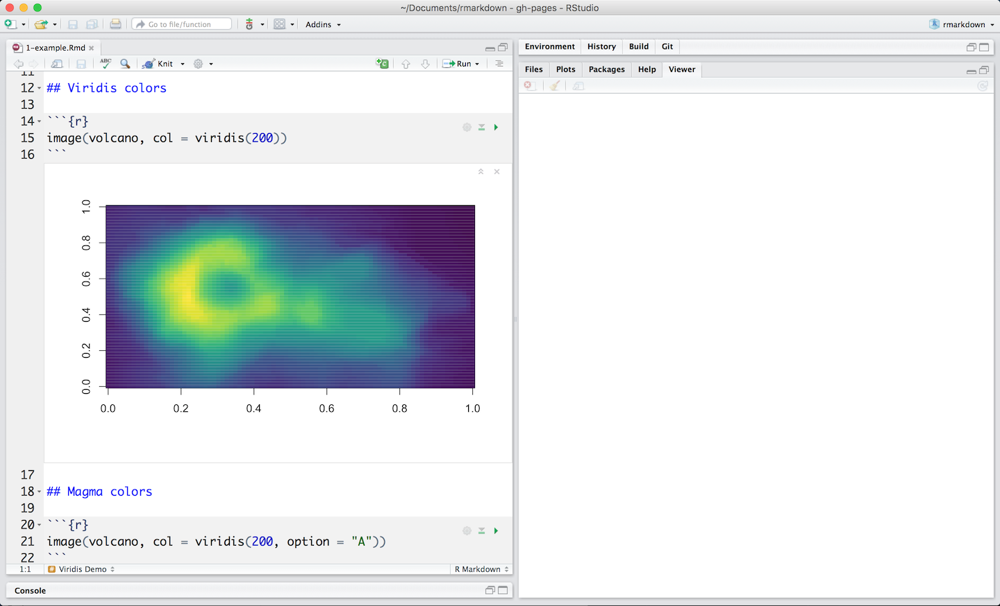

```{r setup, include=FALSE}
knitr::opts_chunk$set(echo = TRUE)
```

***

This [project repository](https://github.com/barrychocolate/Markdown) is hosted on github and can be viewed on Github pages at [https://barrychocolate.github.io/Markdown/R_Studio_Markdown_demo.html](https://barrychocolate.github.io/Markdown/R_Studio_Markdown_demo.html)

# Introduction
## Overview
R Markdown provides an authoring framework for data science. You can use a single R Markdown file to both

* save and execute code
* generate high quality reports that can be shared with an audience


R Markdown documents are fully reproducible and support dozens of static and dynamic output formats.

## Installation
Like the rest of R, R Markdown is free and open source. You can install the R Markdown package from CRAN with:


```
install.packages("rmarkdown")
```

## Get Started
The links to the left provide a quick tour of R Markdown. The links at the top provide examples of R Markdown documents, as well as an in depth discussion of various R Markdown topics.

You may also find the following resources helpful:

* [The R Markdown Cheatsheet ⧉>](https://www.rstudio.com/wp-content/uploads/2016/03/rmarkdown-cheatsheet-2.0.pdf)
* [The R Markdown Reference Guide ⧉](https://www.rstudio.com/wp-content/uploads/2015/03/rmarkdown-reference.pdf)

***
# How It Works
This is an R Markdown file, a plain text file that has the extension .Rmd. You can open a copy [here ⧉ ](https://rstudio.cloud/project/181856)on RStudio Cloud.


Notice that the file contains three types of content:

* An (optional) YAML header surrounded by ```---```s
* R code chunks surrounded by `` ``` `` s
* text mixed with simple text formatting

## A Notebook Interface
When you open the file in the RStudio IDE, it becomes a [notebook interface for R ⧉](https://bookdown.org/yihui/rmarkdown/notebook.html). You can run each code chunk by clicking the icon. RStudio executes the code and display the results inline with your file.



## Rendering output
To generate a report from the file, run the render command:
```
library(rmarkdown)
render("1-example.Rmd")
```
Better still, use the “Knit” button in the RStudio IDE to render the file and preview the output with a single click or keyboard shortcut (⇧⌘K).


R Markdown generates a new file that contains selected text, code, and results from the .Rmd file. The new file can be a finished [web page ⧉](https://bookdown.org/yihui/rmarkdown/html-document.html), [PDF ⧉,](https://bookdown.org/yihui/rmarkdown/pdf-document.html) [MS Word document⧉ ](https://bookdown.org/yihui/rmarkdown/word-document.html), [slide show ⧉](https://bookdown.org/yihui/rmarkdown/ioslides-presentation.html), [notebook ⧉,](https://bookdown.org/yihui/rmarkdown/notebook.html) [handout ⧉,](https://bookdown.org/yihui/rmarkdown/tufte-handouts.html) [book ⧉](https://bookdown.org/), [dashboard,](https://rmarkdown.rstudio.com/flexdashboard/index.html) [package vignette ⧉ ](https://bookdown.org/yihui/rmarkdown/r-package-vignette.html) or [other format](https://rmarkdown.rstudio.com/formats.html).

## How it works


When you run render, R Markdown feeds the .Rmd file to [knitr ⧉](http://yihui.name/knitr/), which executes all of the code chunks and creates a new markdown (.md) document which includes the code and it’s output.  

The markdown file generated by knitr is then processed by [pandoc ⧉](http://pandoc.org/) which is responsible for creating the finished format.  

This may sound complicated, but R Markdown makes it extremely simple by encapsulating all of the above processing into a single  ```render``` function.

***
# Code Chunks
The R Markdown file below contains three code chunks. You can open it [here ⧉](https://rstudio.cloud/project/181911) in RStudio Cloud.


You can quickly insert chunks like these into your file with

* the keyboard shortcut **Ctrl + Alt + I** (OS X: **Cmd + Option + I**)
* the Add Chunk  command in the editor toolbar

or by typing the chunk delimiters \```{r} and ```.

When you render your .Rmd file, R Markdown will run each code chunk and embed the results beneath the code chunk in your final report.

## Chunk Options
Chunk output can be customized with [knitr options ⧉](v
http://yihui.name/knitr/options/), arguments set in the {} of a chunk header. Above, we use five arguments:

* include = FALSE prevents code and results from appearing in the finished file. R Markdown still runs the code in the chunk, and the results can be used by other chunks.
* echo = FALSE prevents code, but not the results from appearing in the finished file. This is a useful way to embed figures.
* message = FALSE prevents messages that are generated by code from appearing in the finished file.
* warning = FALSE prevents warnings that are generated by code from appearing in the finished.
* fig.cap = "..." adds a caption to graphical results. 

See the [R Markdown Reference Guide ⧉](https://www.rstudio.com/wp-content/uploads/2015/03/rmarkdown-reference.pdf) for a complete list of knitr chunk options.

## Global Options
To set global options that apply to every chunk in your file, call knitr::opts_chunk$set in a code chunk. Knitr will treat each option that you pass to knitr::opts_chunk$set as a global default that can be overwritten in individual chunk headers.

## Caching
If document rendering becomes time consuming due to long computations you can use knitr caching to improve performance. [Knitr chunk and package options](http://yihui.name/knitr/options) describes how caching works and the [Cache examples](http://yihui.name/knitr/demo/cache/) provide additional details.

***
# Inline Code
Code results can be inserted directly into the text of a .Rmd file by enclosing the code with ``` `r ` ```. The file below uses ``` `r ` ``` twice to call  colorFunc, which returns “heat.colors.” You can open the file [here ⧉](https://rstudio.cloud/project/181921) in RStudio Cloud.


Using ``` `r ` ``` makes it easy to update the report to refer to another function.


R Markdown will always

* display the results of inline code, but not the code
* apply relevant text formatting to the results  

As a result, inline output is indistinguishable from the surrounding text. Inline expressions do not take knitr options.

***

# Code Languages
Notice how this .Rmd file executes code in bash and python. You can open the file [here ⧉](https://rstudio.cloud/project/181938) in RStudio Cloud.


[knitr ⧉](http://yihui.name/knitr/) can execute code in many languages besides R. Some of the available language engines include:

* Python
* SQL
* Bash
* Rcpp
* Stan
* JavaScript
* CSS

To process a code chunk using an alternate language engine, replace the `r` at the start of your chunk declaration with the name of the language:

```
```{bash}
```
```

Note that chunk options like `echo` and `results` are all valid when using a language engine like python.

Learn more about using other languages with R Markdown in [knitr Language Engines ⧉](https://bookdown.org/yihui/rmarkdown/language-engines.html)
